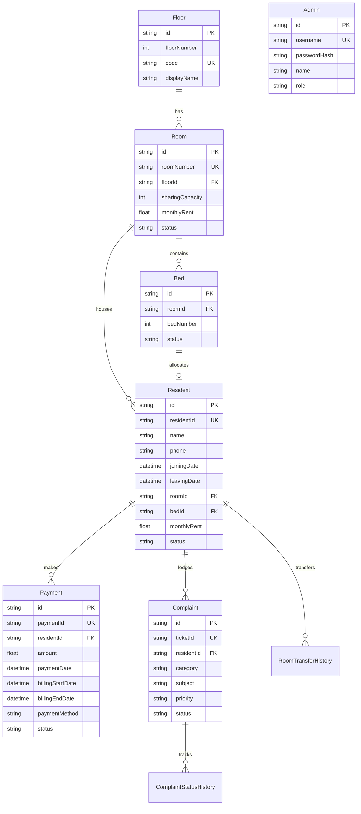

# 🏢 Elite Homes — Hostel & PG Management System

<div align="center">


### *Next-Generation, Automated PG & Hostel Accommodation Management Platform*

[](https://nextjs.org/)
[](https://react.dev/)
[](https://www.typescriptlang.org/)
[](https://tailwindcss.com/)
[](https://www.prisma.io/)
[](https://www.sqlite.org/)
[](https://lucide.dev/)
[](https://jwt.io/)
[](https://opensource.org/licenses/MIT)

[Live Demo](#-getting-started) • [Key Features](#-key-features) • [Building Layout](#-building-layout--floor-plan) • [Database Schema](#-database-schema--architecture) • [API Reference](#-api-endpoints)

</div>

---

## 📖 Table of Contents

- [Overview](#-overview)
- [Key Features](#-key-features)
- [Technology Stack](#-technology-stack)
- [Building Layout & Capacity](#-building-layout--floor-plan)
- [Database Schema & Architecture](#-database-schema--architecture)
- [Project Directory Structure](#-project-directory-structure)
- [Getting Started](#-getting-started)
- [Default Accounts & Credentials](#-default-accounts--credentials)
- [Receipt & Print Engine](#-digital-receipt--print-engine)
- [Brand Identity & Logo Design](#-brand-identity--logo-design)
- [API Endpoints Reference](#-api-endpoints)
- [Contributing & License](#-license)

---

## 🌟 Overview

**Elite Homes PG Management** is an enterprise-grade, automated management platform engineered specifically for modern coliving spaces, hostels, and paying guest (PG) accommodations.

Historically, PG owners relied on physical paper notebooks, manual ledger logs, and unstructured WhatsApp messaging to track rent payments, room allocations, and resident complaints. This led to:
- ❌ **Lost revenue & unrecorded dues** due to inconsistent billing cycle dates.
- ❌ **Allocation confusion & double bookings** across multiple sharing rooms.
- ❌ **Unresolved maintenance complaints** with zero accountability or timeline tracking.
- ❌ **Cluttered, informal receipts** containing no digital verification or official signature stamps.

**Elite Homes** eliminates these pain points with a unified, real-time platform delivering:
1. **Interactive Building Map**: Instant bed-level visual tracking across 6 floors and 287 beds.
2. **Automated Anniversary Billing**: Intelligent monthly rent calculation clamped to each resident's exact joining date anniversary (handling 28/29/30/31 day month transitions).
3. **Verified Digital Receipts**: Vector-branded, print-isolated receipts ready for physical printing or instant PDF download.
4. **Transparent Complaint Resolution**: 3-stage ticket tracking (Submitted ➔ In Progress ➔ Resolved) with admin comment logs.
5. **Dual Portal Access**: Dedicated interfaces for Facility Admins and Residents.

---

## ⚡ Key Features

### 🏢 1. Visual Building Map & Bed Allocation
- **6-Floor Interactive Matrix**: Ground Floor (6-sharing) and Floors A–E (2, 3, 4, and 5-sharing).
- **Real-Time Bed Occupancy**: Color-coded badges indicating `AVAILABLE`, `OCCUPIED`, and room-level `PARTIAL` or `FULL` status.
- **One-Click Resident Check-in**: Assign vacant beds directly from the floor plan with automatic capacity recalculation.
- **Seamless Room Transfers**: Bed-to-bed transfers with automated vacancy updates and permanent historical audit logging (`RoomTransferHistory`).

### 💳 2. Smart Rent Ledger & Anniversary Billing
- **Anniversary-Based Billing Cycles**: Calculates monthly dues from the resident's specific move-in date rather than rigid calendar months.
- **Month-End Date Clamping**: Automatically handles tricky calendar variations (e.g., January 31st anniversary clamps to February 28th/29th).
- **Multi-Gateway Payment Recording**: Tracks payments via `UPI`, `CASH`, `BANK_TRANSFER`, `CARD`, and `CHEQUE` with transaction reference codes.
- **Due Date Indicator Strip**: Real-time status tags: `PAID`, `DUE_TODAY`, `DUE_SOON`, `PENDING`, and `OVERDUE`.

### 🖨️ 3. Official Print & PDF Digital Receipt Generator
- **Print-Isolated Layout**: Custom `@media print` CSS isolating the receipt card from website chrome (navbars, sidebars, theme toggles, and admin credentials never leak into prints).
- **Edge & Chromium Optimized**: Built-in `beforeprint` and `afterprint` hooks to prevent scroll clipping, paired with `-webkit-print-color-adjust: exact` for rich vector gradients.
- **Full Receipt Details**: Includes Elite Homes vector brand logo, verified digital stamp, resident details, room & bed numbers, billing period, payment method, notes, and authorized signature footer.
- **Dual Export Modes**: One-click physical print / "Save as PDF" dialog or dedicated standalone full-page view (`/receipt/[id]`).

### 🛠️ 4. Resident Maintenance & Complaint Tracker
- **Categorized Issue Lodging**: Plumbing, Electrical, Wi-Fi, Food & Dining, Housekeeping, and General.
- **Priority Matrix**: `LOW`, `MEDIUM`, `HIGH`, and `URGENT` triage indicators.
- **Lifecycle Timeline**: Full lifecycle management (`SUBMITTED` ➔ `UNDER_REVIEW` ➔ `ASSIGNED` ➔ `IN_PROGRESS` ➔ `RESOLVED` ➔ `CLOSED`).
- **Audit Trails**: Every status transition logs the modifying admin, timestamps, and resolution notes.

### 🛡️ 5. Dual-Role Portals & Security
- **Admin Management Portal**: High-level KPI dashboards, resident profiles, ledger auditing, bed maps, and system settings.
- **Resident Self-Service Portal**: Quick phone & room lookup, personal dues schedule, latest receipt downloads, and complaint submissions.
- **Flexible Master Admin Auth**: Case-insensitive credential matching, session persistence via secure HTTP cookies, and master password recovery tools.

### 🌓 6. Premium Theme & Glassmorphism Design
- **Dark & Light Mode**: Fluid transitions between executive dark mode (`slate-950`) and crisp daylight view (`slate-50`).
- **Glassmorphism Components**: Translucent cards, subtle ambient glow effects, and modern squircle geometry.
- **Responsive Architecture**: Fully optimized for desktops, tablets, and smartphones.

---

## 🛠️ Technology Stack

| Category | Technology | Version | Purpose |
| :--- | :--- | :--- | :--- |
| **Framework** |  **Next.js** | `14.2.21` | React framework with App Router, server components, and API routes |
| **UI Library** |  **React** | `18.3.1` | Declarative component UI engine with portals and custom hooks |
| **Language** |  **TypeScript** | `5.7.2` | End-to-end static type safety and interface definitions |
| **Styling** |  **Tailwind CSS** | `3.4.16` | Utility-first styling, responsive tokens, and dark mode theming |
| **Database ORM** |  **Prisma** | `5.22.0` | Schema migrations, type-safe queries, and seed orchestration |
| **Database** |  **SQLite** | `3.x` | Embedded relational SQL database engine with zero external setup |
| **Icons** |  **Lucide React** | `0.468.0` | Clean, lightweight SVG icon system |
| **Authentication** |  **JWT** + **bcryptjs** | `9.0.2` / `2.4.3` | Cryptographic password hashing and tamper-proof session tokens |
| **Runtime** |  **Node.js** | `18+ / 20+` | Server execution environment |

---

## 🏢 Building Layout & Floor Plan

Elite Homes PG accommodates **287 beds** across **6 total floors**:

```
┌────────────────────────────────────────────────────────────────────────┐
│                      ELITE HOMES PG FACILITY                          │
├──────────────┬──────────────┬──────────────────┬──────────────┬────────┤
│ Floor        │ Rooms        │ Sharing Format   │ Monthly Rent │ Beds   │
├──────────────┼──────────────┼──────────────────┼──────────────┼────────┤
│ Ground Floor │ G1, G2       │ 6-Sharing        │ ₹5,000 / mo  │ 12     │
│ 1st Floor (A)│ A1 – A8      │ 2, 3, 4, 5-Share │ ₹5.5k – ₹7k  │ 55     │
│ 2nd Floor (B)│ B1 – B8      │ 2, 3, 4, 5-Share │ ₹5.5k – ₹7k  │ 55     │
│ 3rd Floor (C)│ C1 – C8      │ 2, 3, 4, 5-Share │ ₹5.5k – ₹7k  │ 55     │
│ 4th Floor (D)│ D1 – D8      │ 2, 3, 4, 5-Share │ ₹5.5k – ₹7k  │ 55     │
│ 5th Floor (E)│ E1 – E8      │ 2, 3, 4, 5-Share │ ₹5.5k – ₹7k  │ 55     │
├──────────────┴──────────────┴──────────────────┴──────────────┼────────┤
│ TOTAL CAPACITY                                                │ 287    │
└───────────────────────────────────────────────────────────────┴────────┘
```

### Room Sharing Breakdown (Floors A–E)
- **Rooms 1 & 8**: 5-Sharing & 3-Sharing budget accommodations
- **Rooms 2 & 3**: 4-Sharing mid-tier rooms
- **Rooms 4 & 5**: 3-Sharing comfort rooms
- **Rooms 6 & 7**: 2-Sharing executive twin-bed rooms

---

## 📊 Database Schema & Architecture

The application utilizes **Prisma ORM** with **SQLite** for relational data modeling:



---

## 🗂️ Project Directory Structure

```
d:\PG Management\
├── prisma\
│   ├── schema.prisma              # Relational schema (10 models)
│   ├── seed.ts                    # Automatic database seeder
│   └── dev.db                     # SQLite local database
├── public\
│   ├── favicon.svg                # Vector browser tab favicon
│   ├── logo.svg                   # Vector brand master asset
│   └── next.svg                   # Next.js asset
├── src\
│   ├── app\
│   │   ├── admin\                 # Admin Portal Routes
│   │   │   ├── complaints\        # Maintenance ticket triage
│   │   │   ├── dashboard\         # KPI statistics & quick actions
│   │   │   ├── login\             # Master admin sign-in & reset
│   │   │   ├── payments\          # Rent ledger & digital receipts
│   │   │   ├── residents\         # Resident directory & profile views
│   │   │   ├── rooms\             # Interactive 6-floor building map
│   │   │   └── layout.tsx         # Admin shell, sidebar, and theme provider
│   │   ├── api\                   # Next.js REST API Handlers
│   │   │   ├── admin\             # Admin auth, profile, and stats
│   │   │   ├── auth\              # Login, logout, reset, and reinit
│   │   │   ├── complaints\        # Ticket creation and status history
│   │   │   ├── payments\          # Payment recording & receipt fetching
│   │   │   └── residents\         # Check-in, transfer, and checkout
│   │   ├── receipt\[id]\          # Standalone public receipt view
│   │   ├── resident\              # Resident Self-Service Portal
│   │   │   ├── complaints\        # Personal complaint tickets
│   │   │   ├── payments\          # Personal payment history
│   │   │   └── page.tsx           # Resident dashboard
│   │   ├── globals.css            # Tailwind directives & print media rules
│   │   ├── layout.tsx             # Root layout with #app-root print barrier
│   │   └── page.tsx               # Homepage & resident quick lookup
│   ├── components\
│   │   ├── admin\                 # AddResident, RecordPayment, BuildingMap
│   │   ├── receipts\              # ReceiptCard & ReceiptModal portal
│   │   └── ui\                    # BrandLogo, Modal, Navbar, ThemeProvider
│   └── lib\
│       ├── auth.ts                # JWT token signing & cookie verification
│       ├── due-date.ts            # Anniversary billing & clamp calculations
│       ├── id-generator.ts        # Unique IDs (EH-REC, EH-TKT, EH-A07)
│       └── prisma.ts              # Global Prisma client singleton
├── tailwind.config.js             # Design tokens, fonts, and dark mode config
├── tsconfig.json                  # TypeScript compiler settings
└── package.json                   # Project dependencies and scripts
```

---

## 🚀 Getting Started

Follow these steps to run the Elite Homes project locally:

### 1. Prerequisites
Ensure you have the following installed on your machine:
- **Node.js**: `v18.18.0` or higher (Recommended: `v20.x`)
- **npm**: `v9.x` or higher

### 2. Clone and Install Dependencies
```bash
# Navigate to your workspace directory
cd "d:\PG Management"

# Install dependencies
npm install
```

### 3. Initialize the Database
Generate Prisma client artifacts and seed the SQLite database with 6 floors, 287 beds, demo residents, payments, and tickets:
```bash
# Generate Prisma Client
npx prisma generate

# Push schema changes to SQLite database
npx prisma db push

# Seed default floors, rooms, beds, and records
npm run seed
```

### 4. Run Development Server
```bash
npm run dev
```
Open **[http://localhost:3000](http://localhost:3000)** in your browser (supports Microsoft Edge, Google Chrome, Brave, Firefox, Safari).

### 5. Production Build
To test the optimized production build:
```bash
npm run build
npm run start
```

---

## 👤 Default Accounts & Credentials

### Master Admin Portal (`/admin/login`)
- **Portal URL**: `http://localhost:3000/admin/login`
- **Username**: `akash7070` *(case-insensitive: accepts `akash7070`, `Akash`, or `Akash7070`)*
- **Display Name**: `Akash`
- **Self-Healing Recovery**: If the password is ever forgotten, click **"Reset Master Password?"** directly on the login screen to set a new password.

### Resident Portal (`/`)
- **Portal URL**: `http://localhost:3000`
- **Sample Resident Name**: `Rahul Kumar`
- **Phone Number**: `9876543210`
- **Allocated Room & Bed**: Room `A7`, Bed `2` (Floor A)
- **Resident ID**: `EH-A07-001`

---

## 🖨️ Digital Receipt & Print Engine

The receipt printing engine is engineered to prevent common browser print bugs:

```
┌────────────────────────────────────────────────────────┐
│                  PRINT ENGINE FLOW                     │
├────────────────────────────────────────────────────────┤
│ 1. User clicks "Save / View Receipt"                   │
│ 2. React Portal mounts ReceiptModal to document.body   │
│ 3. Body overflow is managed via before/afterprint      │
│ 4. @media print sets #app-root to display: none        │
│ 5. -webkit-print-color-adjust: exact preserves colors  │
│ 6. Modal unfolds into static document flow             │
│ 7. Browser prints ONLY the official verified receipt   │
└────────────────────────────────────────────────────────┘
```

- **Zero Website UI Leaks**: The main `#app-root` is hidden during printing, ensuring navbars, sidebars, buttons, and admin credentials never appear on the printed document.
- **Edge & Chromium Certified**: Tested with Microsoft Edge (`msedge`) and Chrome print preview engines.
- **High-Contrast Print Typography**: Automatically forces all text to deep dark slate (`#0f172a`) in print, preventing white-on-white text issues when printing from Dark Mode.

---

## 🎨 Brand Identity & Logo Design

The **Elite Homes PG** brand identity is rendered via a custom, resolution-independent SVG component ([src/components/ui/BrandLogo.tsx](src/components/ui/BrandLogo.tsx)):

```
       ★ (Apex Gold Beacon Star)
      / \
    /_____\ (Residential Gable Roofline)
    |  |  |
    |  |==| (Interlocking "EH" Monogram & High-Rise Coliving Towers)
    |__|__|
   ═════════ (Foundation Accent Bar)
```

- **Architectural Symbolism**: Blends an executive high-rise structure with residential roof gables to symbolize community and safety.
- **Golden Apex Star**: Represents high standards of hygiene and comfort.
- **Dynamic Color Harmony**: Royal Indigo (`#4338ca`) and Vibrant Sky Cyan (`#0284c7`) with gold accent gradients (`#fbbf24`).
- **100% Transparent Background**: Perfect contrast across both light paper backgrounds and sleek dark mode glassmorphism panels.

---

## 🔗 API Endpoints

### 🔐 Authentication & Profile
| Method | Endpoint | Description |
| :--- | :--- | :--- |
| `POST` | `/api/auth/admin` | Authenticate master admin credentials |
| `GET` | `/api/auth/admin` | Retrieve current authenticated admin session |
| `POST` | `/api/auth/admin/reset` | Emergency master password reset |
| `POST` | `/api/auth/logout` | Invalidate JWT session and clear auth cookies |
| `POST` | `/api/auth/resident` | Resident login via phone and room verification |

### 🏢 Rooms & Floor Plan
| Method | Endpoint | Description |
| :--- | :--- | :--- |
| `GET` | `/api/admin/floors` | Fetch all 6 floors with room and bed occupancy trees |
| `GET` | `/api/admin/stats` | Aggregated dashboard statistics and revenue metrics |

### 👥 Residents
| Method | Endpoint | Description |
| :--- | :--- | :--- |
| `GET` | `/api/admin/residents` | List residents with search, room, and status filters |
| `POST` | `/api/admin/residents` | Check in new resident and reserve designated bed |
| `GET` | `/api/admin/residents/[id]` | Full resident profile, payment ledger, and complaints |
| `POST` | `/api/admin/residents/[id]/transfer` | Transfer resident to a new room and bed |
| `POST` | `/api/admin/residents/[id]/checkout` | Checkout resident and vacate assigned bed |

### 💳 Payments & Billing
| Method | Endpoint | Description |
| :--- | :--- | :--- |
| `GET` | `/api/payments` | Query payment ledger (supports status and resident filters) |
| `POST` | `/api/payments` | Record payment transaction and generate receipt ID |
| `GET` | `/api/payments/[id]` | Fetch single verified payment receipt |

### 🛠️ Maintenance & Complaints
| Method | Endpoint | Description |
| :--- | :--- | :--- |
| `GET` | `/api/complaints` | Fetch complaints list with category and priority filters |
| `POST` | `/api/complaints` | Submit maintenance ticket |
| `PATCH` | `/api/complaints/[id]` | Update ticket status (`IN_PROGRESS`, `RESOLVED`, etc.) |

---

## 📄 License

This project is licensed under the **MIT License** — see the [LICENSE](LICENSE) file for details.

---

<div align="center">

**Built with precision for Elite Homes PG Accommodation**

*Crafted using Next.js 14, React 18, TypeScript, Tailwind CSS, and Prisma ORM.*

</div>
